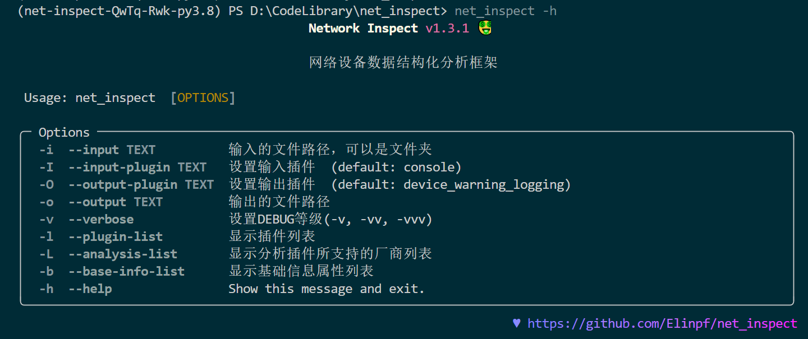
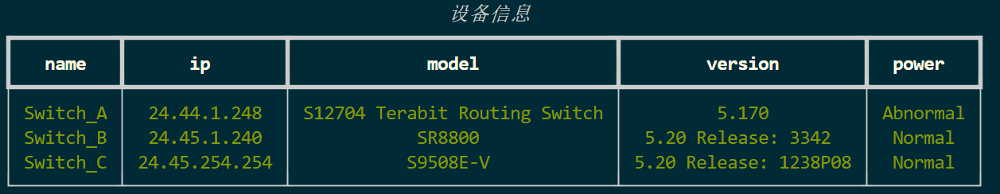

[](https://pypi.org/project/net-inspect)
[](https://github.com/Elinpf/net_inspect)
[](https://github.com/Elinpf/net_inspect/stargazers)
[](https://github.com/Elinpf/net_inspect/blob/master/LICENSE)
[](https://codecov.io/gh/Elinpf/net_inspect)

## 前言

作为网络工程师，需要经常收集设备的设备信息，比如设备CPU利用率、内存利用率、软件版本、序列号、接口状态等，这些信息可以用来监控网络设备的运行状态，也可以用来做设备的资产管理。

在已经收集完成的情况下，我们需要将关键信息提取出来，然后将可用数据按需求格式输出。市面上目前没有针对多厂商的网络设备数据解析工具，厂家只会制作针对自己设备的解析工具。造成使用割裂，并且输出样式也无法做到自定义。

另外，网络工程师学习编程后大部分都是单兵作战，针对自己的使用场景，进行专门的脚本编写，这就导致了脚本的可复用性很差，如果需要在其他场景下使用，就需要重新编写脚本，这样会造成很大的工作量。

之前通常情况下，都会通过`vty` 或者 `console` 连接到设备上，然后通过`show`或者`display`命令获取设备的状态信息，然后通过`textFSM`或者正则表达式解析数据，最后将可用的数据按需求格式进行输出。

但是，这样的操作方式有很多不便，比如：

1. 在通过`show`或者`display`将信息收集后，如何分割命令的回显？哪些是无效命令？
2. 网管平台收集的信息格式不一样怎么处理？
3. 如何识别设备对应的厂商？
4. 如何调用对应的`textFSM`模板？
5. 如何搜索命令获取关键信息？
6. 多厂商的情况下，如何做到统一的数据调用？
7. 多厂商的情况下，如何做到统一的数据格式？
8. `ntc-templates`大部分模板都是国外厂商，怎么办？
9. 如何在调用`ntc-templates`的同时调用自己写的`textFSM`模板库？
10. 设计的脚本只针对单一情况，如何解决复用性的问题？

要解决以上问题，就需要用到`net_inspect`这个框架。

它可以让使用者无需关心数据处理的各种细节以及各个厂家的差异。屏蔽了厂商差异，只需要在数据处理完成后通过统一的方式调用即可。

## net_inspect框架介绍

[net_inspect](https://github.com/Elinpf/net_inspect)是一个基于`python`的网络设备数据解析自动化框架

框架设计的初衷就是将各个环节解耦，使各个环节能够独立开发扩展，最终实现对多厂商设备的数据解析。

安装方法：

```bash
pip install net_inspect
```

### 一个简单的例子

```
├── log
│   ├── Switch_A.log
│   ├── Switch_B.log
│   ├── Switch_C.log
```

可用看到，在`log`文件夹下有三台设备的命令的回显信息，这些文件是通过`vty`或者`console`连接到设备上作为记录日志保存下来。每个文件中都需要包含`display version` 这个命令来识别设备的厂商。

现在我们需要将这些设备的厂商、软件版本、管理IP，提取打印出来。

```py
from net_inspect import NetInspect

net = NetInspect()
net.set_plugins(input_plugin='console')
net.run(input_path='log')

print('total devices:', len(net.cluster.devices))

for device in net.cluster.devices:
    info = device.info
    print(' | '.join([info.hostname, info.ip, info.vendor,
          info.version, info.model, info.cpu_usage]))
```

output:

```text
total devices: 3
Switch_A | 24.44.1.248 | Huawei | 5.170 | S12704 Terabit Routing Switch | 6%
Switch_B | 24.45.1.240 | H3C | 5.20 Release: 3342 | SR8800 | 5%
Switch_C | 24.45.254.254 | H3C | 5.20 Release: 1238P08 | S9508E-V | 1%
```

可以看到，仅仅通过简单的几行代码，就可以实现对多厂商设备的数据解析和调用。

> `console`代表的是`vty`或者`console`连接设备的回显信息格式。

> 可供使用的base_info属性信息在使用`net_inspect -b`查看
> 其中`analysis`的分析结果均是`Optional[bool]` 类型
> 1. 如果为`None`，则表示未分析出结果。
> 2. 如果为`True`，则表示有告警级别的信息。
> 3. 如果为`False`，则表示为正常或者只是关注级别的信息。

### 框架的组成

`net_inspect`由以下几个部分组成：

- `input_plugin` 输入插件，用于将设备的回显进行分割，将每个执行的命令和对应的回显作为字典储存。
- `parse_plugin` 解析插件，用于对命令进行解析，一般情况下不需要进行修改。
- `analysis_plugin` 分析插件，每一个分析插件对应一个状态分析，比如`power_status`就是用来分析设备的电源状态的。
- `output_plugin` 输出插件，用于输出统一的格式报告。
- `base_info` 基础信息，用于存放设备的基础信息，比如厂商、软件版本、管理IP等。可以全厂商统一调用。

> 有时候我们收集设备信息的方式不止是通过console，或者自己的telnet/ssh。而是通过网管平台进行的，回显格式不同，这时候就需要自己写一个`input_plugin`，将网管平台的数据转换成`net_inspect`需要的格式。

> `parse_plugin` 使用的是[ntc_templates_elinpf](https://github.com/Elinpf/ntc-templates)这个库，它是`ntc_templates`的一个分支，主要是为了解决`ntc_templates`没有对国内厂商支持的问题。

> 所以，需要先卸载`pip uninstall ntc_templates` 然后安装`pip install ntc_templates_elinpf`

`net_inspect`支持cli的命令行模式，可以通过`net_inspect -h`查看帮助信息。




## 进阶教程

上面的简单例子中还有很多地方没有涉及到，比如`analysis_plugin`的使用，`base_info`的使用，`output_plugin`的使用等等。

试想一个情况，我们需要获取设备的`show clock`信息，在`ntc_templates_elinpf`中没有，怎么办？

### 调用外部textFSM模板

要解决`ntc_templates_elinpf`中没有模板的问题，我们可以自己写一个本地的textFSM模板仓库，然后调用。

```text
├── local_templates
│   ├── huawei_vrp_display_clock.textfsm
│   ├── hp_comware_display_clock.textfsm
│   ├── cisco_ios_show_clock.textfsm
│   ├── index
```

可以看到上面的本地模板库中，包含了`huawei_vrp`、`hp_comware`、`cisco_ios`三个厂商的`display clock`模板。

另外还有一个`index`文件，用于指定模板的调用命令，毕竟我们在敲命令的时候不会敲全，比如`display clock`，我们可以敲`dis clo`，这时候就需要`index`文件来指定。

`index`文件内容如下:

```text
Template, Hostname, Platform, Command

huawei_vrp_display_clock.textfsm, .*, huawei_vrp, dis[[play]] clo[[ck]]

hp_comware_display_clock.textfsm, .*, hp_comware, di[[splay]] clo[[ck]]

cisco_ios_show_clock.textfsm, .*, cisco_ios, sh[[ow]] clo[[ck]]
```

注意每个厂商需要空格隔开, 并且开头必须要有`Template, Hostname, Platform, Command`这行。

做好准备工作后，只需要在脚本中调用本地模板库即可。

```python
from net_inspect import NetInspect, vendor

net = NetInspect()
net.set_plugins(input_plugin='console')
net.set_external_templates('local_templates')  # 调用本地模板库
net.run(input_path='log')

print('total devices:', len(net.cluster.devices))

for device in net.cluster.devices:
    info = device.info
    clock = ''
    if device.vendor == vendor.Huawei:
        with device.search_cmd('display clock') as cmd:
            if cmd.parse_result:
                ps = cmd.parse_result[0]
                clock = f"{ps['year']}-{ps['month']}-{ps['day']} {ps['time']}"

    if device.vendor == vendor.H3C:
        with device.search_cmd('display clock') as cmd:
            if cmd.parse_result:
                ps = cmd.parse_result[0]
                clock = f"{ps['year']}-{ps['month']}-{ps['day']} {ps['time']}"

    print(' | '.join([info.hostname, clock]))
```

output:

```text
total devices: 3
Switch_A | 2021-03-19 10:23:08
Switch_B | 2021-03-19 10:24:17
Switch_C | 2021-03-19 10:32:17
```

可以看到，我们通过调用本地模板库，成功解析了`display clock`命令。

然后搜索厂商对应的命令，将解析的结果格式化为我们想要的格式。最后再输出。

这样的写法是否有点麻烦，并且不利于复用呢？有没有更好的方式呢？

### 新增基础信息

我们可以在`base_info`中新增一个`clock`字段，然后只需要调用这个`clock`属性就可以了，方法如下：

```python
from net_inspect import NetInspect, EachVendorDeviceInfo, BaseInfo, Device


class AppendClock(BaseInfo):
    clock: str = ''  # 巡检时间


class EachVendorWithClock(EachVendorDeviceInfo):

    base_info_class = AppendClock  # 基本信息类

    def do_huawei_vrp_baseinfo_2(self, device: Device, info: AppendClock):
        # 添加do_<vendor_platform>_baseinfo_<something>方法，可以自动运行
        with device.search_cmd('display clock') as cmd:
            if cmd.parse_result:
                row = cmd.parse_result[0]
                info.clock = f'{row["year"]}-{row["month"]}-{row["day"]} {row["time"]}'

    def do_hp_comware_baseinfo_2(self, device: Device, info: AppendClock):
        with device.search_cmd('display clock') as cmd:
            if cmd.parse_result:
                row = cmd.parse_result[0]
                info.clock = f'{row["year"]}-{row["month"]}-{row["day"]} {row["time"]}'


if __name__ == '__main__':
    net = NetInspect()
    net.set_plugins(input_plugin='console')
    net.set_base_info_handler(EachVendorWithClock)  # 设置获取设备基本信息的处理类
    net.set_external_templates('local_templates')
    net.run(input_path='log')

    print('total devices:', len(net.cluster.devices))

    for device in net.cluster.devices:
        info = device.info  # type: AppendClock
        print(' | '.join([info.hostname, info.clock]))
```

output:

```text
total devices: 3
Switch_A | 2021-03-19 10:23:08
Switch_B | 2021-03-19 10:24:17
Switch_C | 2021-03-19 10:32:17
```

输出的结果是一样的，可以看到，在`base_info`中新增了一个`clock`字段，然后只需要调用这个`clock`属性就可以了。这样的做法复用性强，后续再想要获取设备的时间的时候，只需要调用`clock`属性即可。

### 自定义分析信息

完成了数据的解析调用，下面还需要对设备进行分析，比如判断电源、风扇是否故障，cpu、memory利用率是否过高等。

当`net_inspect`中没有需要的分析模块时，我们可以自定义分析模块。

比如我们写一个检查OSPF邻居状态的分析模块

```py
from __future__ import annotations

from typing import TYPE_CHECKING
from net_inspect import NetInspect, vendor
from net_inspect.analysis_plugin import analysis, AnalysisPluginAbc

if TYPE_CHECKING:
    from net_inspect.analysis_plugin import TemplateInfo
    from net_inspect.domain import AnalysisResult


class AnalysisPluginWithOSPFStatus(AnalysisPluginAbc):
    """OPSF status 状态不能为Init"""

    @analysis.vendor(vendor.Huawei)
    @analysis.template_key('huawei_vrp_display_ospf_peer_brief.textfsm', ['neighbor', 'state'])
    def huawei_vrp(template: TemplateInfo, result: AnalysisResult):
        """华为状态检查"""
        for row in template['display ospf peer brief']:
            if row['state'].lower() == 'init':
                result.add_warning(f'{row["neighbor"]} is in init state')


if __name__ == '__main__':
    net = NetInspect()
    net.set_plugins(input_plugin='console')
    net.run(input_path='log')

    print('total devices:', len(net.cluster.devices))

    for device in net.cluster.devices:
        ospf_status = device.analysis_result.get('ospf status')
        warning_list = []
        for alarm in ospf_status:
            if alarm.is_warning:
                warning_list.append(alarm.message)

        print(' | '.join([device.info.hostname, ', '.join(warning_list)]))
```

output:

```text
total devices: 3
Switch_A | 24.42.254.20 is in init state
Switch_B |
Switch_C |
```

这样我们就得到了一个可重复利用的分析模块，后续在想要检查OSPF邻居状态的时候，只需要调用这个模块即可。

这里的案例只添加了`Huawei`这一个厂家的分析方法，其他厂家的分析方法大家可以自行添加。

编写这个需要注意：
1. `@analysis.template_key`中的`templates`名称需要完整包含后缀名。
2. 类方法不需要`self`这个关键字。
3. 结果加入到`result`中即可，不需要返回值。
4. 整个过程不用单独设置，所有信息会直接写入`analysis`变量中。
5. 类注释和方法注释必须要写，因为会用到这个注释作为分析结果的标题。


### 自定义输出模块

完成了数据的分析后，需要对结果进行调用，可以直接以写脚本的方式，也可以自定义输出模块。

自定义输出模块的方式方便二次调用，比如我们写一个输出table的例子：

```py
from net_inspect import NetInspect, OutputPluginAbstract
from rich.table import Table
from rich.console import Console


class Output(OutputPluginAbstract):
    def main(self):
        console = Console()

        table = Table(title=self.args.output_params.get(
            'title'), show_lines=False)
        columns = ['hostname', 'ip', 'model', 'version', 'power status']
        for col in columns:
            table.add_column(col, justify='center')
        table.row_styles = ['green']

        for device in self.args.devices:
            info = device.info
            table.add_row(
                info.hostname,
                info.ip,
                info.model,
                info.version,
                'Abnormal' if info.analysis.power else 'Normal'
            )

        console.print(table)

if __name__ == '__main__':

    net = NetInspect()
    net.set_plugins(input_plugin='console', output_plugin=Output)
    cluster = net.run(input_path='log', output_plugin_params={
                    'title': '设备信息'})
```

output:



可以看到，我们自定义了一个输出模块，可以直接调用，而不需要写脚本。

`output_plugin_params`中的所有参数都会传递到`Output`类中的`output_params`变量中，可以直接使用。

### 手动添加设备

有时候我们需要手动添加设备，比如我们需要添加一个设备，但是这个设备没有日志，我们可以手动添加，并且指定设备的厂家，这样就可以使用对应厂家的分析模块。

```py
from net_inspect import NetInspect, InputPluginResult, vendor

net = NetInspect()

d = InputPluginResult()
d.add_cmd('display clock', "2021-03-19 10:23:08+08:00")
d.hostname = 'Device'
d.vendor = vendor.Huawei

net.add_device(d)

net.run()

for device in net.cluster.devices:
    print(device.info.hostname)
    print(device.parse_result('dis clo'))
```

output:

```text
Device
[{'time': '10:23:08', 'timezone': '', 'dayweek': '', 'year': '2021', 'month': '03', 'day': '19'}]
```

## 关于贡献

分析插件还在持续开发中，`develop_script.py`脚本就是为高效开发提供的一个工具。

开发一个分析插件的流程，以开发检查风扇状态的`fan_status`插件为例：

1. 创建一个新的插件文件, 对应的文件初始状态会一并准备好

```bash
python ./develop_script.py -p fan_status -g
```

2. 在对应的文件中实现插件对每个厂商分析的函数

```py
class AnalysisPluginWithFanStatus(AnalysisPluginAbc):
    """
    要求设备所有在位风扇模块运行在正常状态。
    """
    @analysis.vendor(vendor.H3C)
    @analysis.template_key('hp_comware_display_fan.textfsm', ['slot', 'id', 'status'])
    def hp_comware(template: TemplateInfo, result: AnalysisResult):
        """模块状态不为Normal的时候告警"""
        for row in template['display fan']:
            if row['status'].lower() != 'normal':
                result.add_warning(
                    f'Slot {row["slot"]} Fan {row["id"]} 状态异常' if row['slot'] else f'Fan {row["id"]} 状态异常')
```

其中`@analysis`是用来记录插件的分析类型的，`vendor`记录插件的厂商类型，`template_key`记录分析模块所需要的`textfsm`文件以及里面的哪些值。
这些值会在参数`template: TemplateInfo`中给出。

`result: AnalysisResult`用来记录分析结果。可以添加告警信息。

分析方法为类方法，不需要`self`,不需要给出返回值。

插件中的类注释和方法注释都会被记录下来，方便后续调用。

3. 创建对应的测试文件

当编写了对应的分析方法后，再次执行创建命令，工具会自动根据分析方法中需要的命令，生成对应的测试文件。

测试文件路径为`tests/check_analysis_plugins/<plugin_name>/<funcation_name>.raw`

```bash
python ./development_script.py -p fan_status -f hp_comware -g
```

4. 在测试文件中添加测试用例
5. 执行测试

```bash
python ./development_script.py -p fan_status -f hp_comware -t
```

6. 完成测试，确认测试结果为正常后，生成yml文件作为参考文件。

```bash
python ./development_script.py -p fan_status -f hp_comware -y
```

