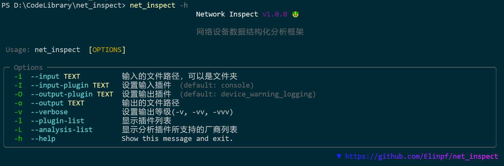

# net_inspect 介绍

`net_inspect`是网络设备数据结构化分析框架


## 安装方法

### PyPI

```bash
pip install net_inspect
```

### Poetry

```bash
git clone https://github.com/Elinpf/net_inspect
cd net_inspect
poetry install
```

## 插件介绍

`net_inspect`采用了插件模块的框架，分别是`Input`, `Parse`, `Analysis`, `Output` 模块。

通过编写模块插件，实现快速定制的能力。

### InputPlugin

Input插件的功能是将**已经获得的设备检查命令的日志**转化为命令与命令输出的对应关系。如果是通过直接对设备进行操作获取的日志，可以使用`console`这个插件进行处理。如果是用的第三方平台进行的自动化收集，那么就需要自行编写Input插件实现命令与输出的对应。

### ParsePlugin

Parse插件的功能是将每条命令的输出进行解析并且结构化。提取出关键信息并以`List[dict]`的方式进行存储。

现有的`Parse`解析模块使用的是[ntc-templates-elinpf](https://github.com/Elinpf/ntc-templates)这个库，是`ntc-templates`库的分支，由于主仓更新频率很慢且不会增加国内常用的设备厂家，所以我Fork后进行了修改。


### AnalysisPlugin

Analysis插件的功能是将解析的信息进行分析，对分析的内容进行告警分级。例如电源是否异常。这个工作是在分析模块中进行的。

### OutputPlugin

输出模块可能是最需要自定义编写的地方。将解析和分析的结果按照自己想要的格式展现出来。

## 使用方法

`net_inspect`有三种使用方式

1. 作为三方库提供API
2. CLI命令行操作
3. 本地Web界面操作 (TODO)


### 使用库

示例:

```python
from net_inspect import NetInspect, OutputPluginAbstract, PluginError
from rich.table import Table
from rich.console import Console


class Output(OutputPluginAbstract):
    def main(self):
        if not self.args.output_params.get('company'):
            raise PluginError('args of `company` is missing')

        console = Console()

        table = Table(title=self.args.output_params.get(
            'company'), show_lines=False)
        table.add_column('name', justify='center')
        table.add_column('ip', justify='center')
        table.add_column('model', justify='center')
        table.add_column('version', justify='center')
        table.add_column('power', justify='center')
        table.row_styles = ['green']

        for device in self.args.devices:  # 一种方式是按照每台设备的对应情况进行单独设置
            if device.vendor.PLATFORM == 'huawei_vrp':
                data = [device.info.hostname, device.info.ip]
                ps = device.parse_result('display version')
                data.append(ps[0].get('model'))
                data.append(ps[0].get('vrp_version'))
                power_analysis = device.analysis_result.get('Power Status')
                power_desc = []
                for alarm in power_analysis:
                    if alarm.above_focus:
                        power_desc.append(alarm.message)
                data.append('\n'.join(power_desc) if power_desc else 'Normal')

                table.add_row(*data)

            else: # 还有一种方式是将每台设备的基础信息直接调取出来使用
                table.add_row(
                    device.info.hostname,
                    device.info.ip,
                    device.info.model,
                    device.info.version,
                    'Abnormal' if device.info.analysis.power else 'Normal'
                )

        console.print(table)


net = NetInspect()
# net.set_log_level('DEBUG')
net.set_plugins(input_plugin='console', output_plugin=Output) # 设置输入输出插件
cluster = net.run('warning_test', output_plugin_params={
                  'company': 'Company Name'})

```

## API 解释

### 初始化

```python
from net_inspect import NetInspect

net = NetInspect()
```

### 设置日志级别

```python
net.verbose(1)
```

开启`verbose`表示为打开了`DEBUG`级别的日志, 默认为`INFO`。
`verbose`级别可以通过`verbose()`方法设置，总共0~3
- 0: 日志关闭
- 1: 提供Output模块的日志和Parse模块的日志
- 2: 追加提供Analysis模块的日志
- 3: 追加提供Parse模块不支持命令的信息日志和命令为无效的信息

### 设置插件

一般来说，只需要设置`input_plugin`和`output_plugin`即可。

```python
net.set_plugins(input_plugin='smartone', output_plugin='device_warning_logging')
```
可以使用字符串的简写，也可以自己继承插件类后重写`main()`方法，然后将类传递进来。

### 执行

提供输入的文件路径即可, 可以是文件或者目录。

```python
net.run('log_files')
```

如果output中需要提供参数，可以使用`output_plugin_params`参数，例如：

```python
net.run('log_files', output_plugin_params={'company': 'Company Name'})
```

### 获取设备的基本信息

已经提供了获取设备的基本信息的方法，可以通过`NetInspect.get_base_info()`方法获取。

例如:
```python
net.run('log_files')
all_info = net.get_base_info()

for info in all_info:
    print(info.hostname)
    print(info.sn)
```

#### 新增设备基本信息类

```py
from net_inspect import NetInspect, EachVendorDeviceInfo, BaseInfo, Device
from rich.table import Table
from rich import print


class AppendClock(BaseInfo):
    clock: str = ''  # 巡检时间


class EachVendorWithClock(EachVendorDeviceInfo):

    base_info_class = AppendClock # 基本信息类

    def do_huawei_vrp_baseinfo_2(self, device: Device, info: AppendClock): 
        # 添加do_<vendor_platform>_baseinfo_<something>方法，可以自动运行
        with device.search_cmd('display clock') as cmd:
            if cmd.parse_result:
                row = cmd.parse_result[0]
                info.clock = f'{row["year"]}-{row["month"]}-{row["day"]} {row["time"]}'


net = NetInspect()
net.set_base_info_handler(EachVendorWithClock) # 设置获取设备基本信息的处理类
net.set_input_plugin('smartone') 
net.run_input('地市巡检')

net.set_input_plugin('console') # 可以多个输入插件同时使用
net.run_input('cisco')

net.run_parse()
net.run_analysis()

table = Table(title='设备信息')
table.add_column('设备名称', style='bold green')
table.add_column('设备型号', style='bold green')
table.add_column('CPU 利用率', style='bold green')
table.add_column('巡检时间', style='bold green')
for device in net.cluster.devices:
    info = device.info  # type: AppendClock
    row = [
        info.hostname,
        info.model,
        info.cpu_usage,
        info.clock # 这里的clock就是新增的
    ]
    table.add_row(*row)

print(table)
```

通过`set_base_info_handler()`方法设置获取设备基本信息的处理类，可以自己增加通用的基础信息，方便后面的调用。


### 调用外部的模板文件

net_inspect支持调用外部模板文件，可以通过`NetInspect.set_external_templates(template_dir)`api设置。

需要注意的是，调用的templates文件夹中必须包含`index`文件，并且文件开头必须为以下内容:

```text
Template, Hostname, Platform, Command
```

设置示例:

```python
net.set_external_templates('external_templates_dir')
```

## CLI 命令行操作



```bash
net_inspect -i log_files
```


## 关于贡献

分析插件还在持续开发中，`develop_script.py`脚本就是为高效开发提供的一个工具。

开发一个分析插件的流程，以开发检查风扇状态的`fan_status`插件为例：

1. 创建一个新的插件文件, 对应的文件初始状态会一并准备好

```bash
python ./develop_script.py -p fan_status -g
```

2. 在对应的文件中实现插件对每个厂商分析的函数

```py
class AnalysisPluginWithFanStatus(AnalysisPluginAbc):
    """
    要求设备所有在位风扇模块运行在正常状态。
    """
    @analysis.vendor(vendor.H3C)
    @analysis.template_key('hp_comware_display_fan.textfsm', ['slot', 'id', 'status'])
    def hp_comware(template: TemplateInfo, result: AnalysisResult):
        """模块状态不为Normal的时候告警"""
        for row in template['display fan']:
            if row['status'].lower() != 'normal':
                result.add_warning(
                    f'Slot {row["slot"]} Fan {row["id"]} 状态异常' if row['slot'] else f'Fan {row["id"]} 状态异常')
```

其中`@analysis`是用来记录插件的分析类型的，`vendor`记录插件的厂商类型，`template_key`记录分析模块所需要的`textfsm`文件以及里面的哪些值。
这些值会在参数`template: TemplateInfo`中给出。

`result: AnalysisResult`用来记录分析结果。可以添加告警信息。

分析方法为类方法，不需要`self`,不需要给出返回值。

插件中的类注释和方法注释都会被记录下来，方便后续调用。

3. 创建对应的测试文件

当编写了对应的分析方法后，再次执行创建命令，工具会自动根据分析方法中需要的命令，生成对应的测试文件。

测试文件路径为`tests/check_analysis_plugins/<plugin_name>/<funcation_name>.raw`

```bash
python ./development_script.py -p fan_status -f hp_comware -g
```

4. 在测试文件中添加测试用例
5. 执行测试

```bash
python ./development_script.py -p fan_status -f hp_comware -t
```

6. 完成测试，确认测试结果为正常后，生成yml文件作为参考文件。

```bash
python ./development_script.py -p fan_status -f hp_comware -y
```

